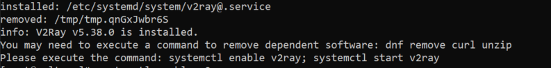
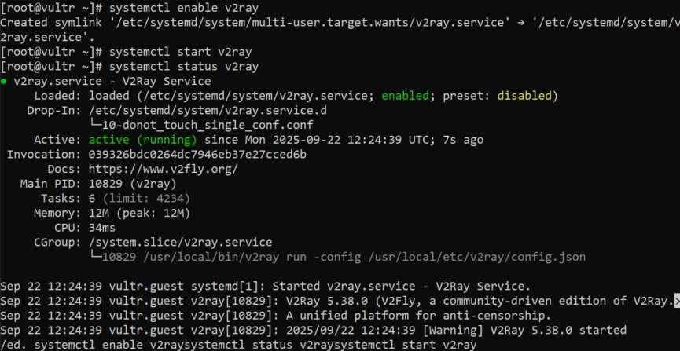
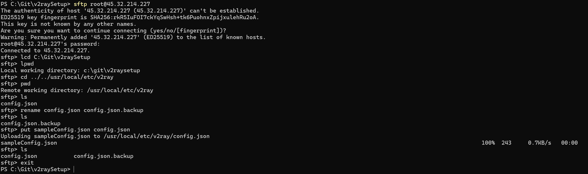
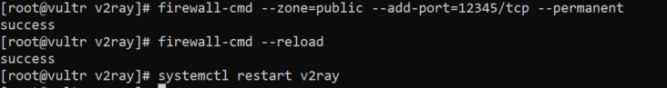
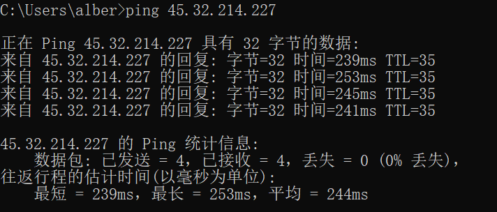

# V2Ray 安装配置

```text
本文不保证时效性，不保证文内链接的可用性，不保证最终构建服务的稳定性，仅供学习。  
如果你看不懂本文在干什么，请直接寻找第三方服务，切勿浪费时间，已关闭issue板块，感谢。
```

- [V2Ray 安装配置](#v2ray-安装配置)
  - [1. 代理的基本知识](#1-代理的基本知识)
    - [什么是代理服务器？](#什么是代理服务器)
    - [什么时候我们需要代理服务器？](#什么时候我们需要代理服务器)
  - [2. 代理服务器的选择](#2-代理服务器的选择)
    - [网络延迟](#网络延迟)
    - [操作系统](#操作系统)
  - [3. 什么是 V2Ray (Project V)](#3-什么是-v2ray-project-v)
  - [4. 如何在服务器端安装配置 V2Ray 服务](#4-如何在服务器端安装配置-v2ray-服务)
    - [安装 V2Ray 服务](#安装-v2ray-服务)
    - [启用 V2Ray 服务](#启用-v2ray-服务)
    - [配置 V2Ray服务](#配置-v2ray服务)
  - [5. 如何在客户端配置安装 V2RayN / V2RayNG](#5-如何在客户端配置安装-v2rayn--v2rayng)
  - [ping 使用指南](#ping-使用指南)
  - [tracert 使用指南](#tracert-使用指南)
  - [iperf3 使用指南](#iperf3-使用指南)
  - [SSH 使用简要指南](#ssh-使用简要指南)
  - [防火墙端口配置](#防火墙端口配置)
  - [关于ipv6](#关于ipv6)
  - [题外话](#题外话)

## 1. 代理的基本知识

在开始设置之前，推荐你阅读本段内容以了解基本的代理相关知识。

### 什么是代理服务器？

代理服务器（Proxy Server）是一种位于您的设备（如电脑、手机）和互联网之间的中间服务器，它的核心功能是 **“代你办事”** 。  

您可以把它想象成一位中间人或代理人：  

&emsp;没有代理时： 您的设备 → 直接访问网站  
&emsp;使用代理时： 您的设备 → 代理服务器 → 网站  

当您使用代理服务器时，网络流量不会直接发送到目标网站，而是先发送到代理服务器，由代理服务器替你访问网站，然后再将网站的内容返回给您。  

### 什么时候我们需要代理服务器？

| 情况    | 代理服务器的作用 |
|:-------|:----------------|
|保护隐私 |隐藏您的真实 IP 地址|
|突破限制 |访问被地理封锁或网络防火墙屏蔽的内容|
|管理网络 |公司/学校过滤不当内容，控制上网行为|
|加速访问 |通过缓存常用内容节省带宽、提高速度|
|增强安全 |作为内部网络的缓冲层，过滤恶意流量|

## 2. 代理服务器的选择

代理服务器的核心目的是优化网络路径、提升访问效率、增强安全性与隐私性。

### 网络延迟

网络延迟（Ping值）直接决定了代理服务的体验。  
选择的目标不是单纯追求“国外服务器”，而是根据实际应用场景找到延迟最低、最稳定的路径。

- 明确需求
  - 优化国内访问（游戏加速、跨网访问）
  - 海外业务访问（企业办公、学术研究）
  - 全局网络优化

- 测试和选择
  - Step 1: 获取测试IP：向服务商索取或在其官网找到服务器的测试IP地址。
  - Step 2: 本地延迟测试：  
        &emsp;在本地电脑的命令提示符或PowerShell中，执行 [ping](#ping-使用指南) &lt;服务器IP&gt;。  
        &emsp;观察结果：时间=&lt;XX&gt;ms 就是延迟。通常，&lt; 50ms 极佳（国内），50ms-150ms 良好（跨境优质线路），&gt;200ms 会有明显延迟感。  
        &emsp;关键点：不仅要看延迟，还要看稳定性（是否跳ping，即延迟数值波动很大）。  
  - Step 3: 路由追踪测试（更高级）：  
        &emsp;执行 [tracert](#tracert-使用指南) &lt;服务器IP&gt;（Windows）或 traceroute &lt;服务器IP&gt;（Linux/Mac）。  
        &emsp;观察结果：这条命令会显示数据包从你电脑到服务器经过的每一跳（路由器）。你可以看到在哪里延迟突然增高，从而判断网络拥堵点。  
  - Step 4: 带宽测试：  
        &emsp;使用 [iperf3](#iperf3-使用指南) 或服务商提供的测试URL，在测试服务器的上传/下载速度，确保带宽满足你的需求。

### 操作系统

选择OS主要关乎长期维护成本、安全性和软件兼容性。对于运行代理服务（如v2ray, Xray）来说，主流选择是Linux发行版。

- 选择建议：
  - 无脑之选：Ubuntu LTS，Debian或CentOS。它们拥有最广泛的社区支持和文档资源，非常适合部署v2ray等代理服务。
  - 新手友好：虽然Windows有图形界面，但更推荐学习使用Linux。通过SSH远程管理，一次配置好后几乎不需要再登录，效率更高、更稳定。
  - 追求轻量：可以考虑更极简的发行版，如Alpine Linux，但其使用方式与Ubuntu/Debian略有不同。

本文将以CentOS为例讲解v2ray代理服务的安装与配置，客户端操作系统为Windows/Android，其他系统请参考官方文档进行配置安装。

## 3. 什么是 V2Ray (Project V)

简而言之，一个开源的网络代理工具，如有兴趣请阅读下面文档。  
[Project V](https://www.v2ray.com/)：Project V（V2Ray）官方文档  
[v2ray manual](https://github.com/v2ray/manual)：已过时，请查看 [V2Fly](https://github.com/v2fly/v2fly-github-io)。  
[V2Ray 配置指南（非官方）](https://toutyrater.github.io/)  
[fhs-install-v2ray（一键部署v2ray）](https://github.com/v2fly/fhs-install-v2ray)

## 4. 如何在服务器端安装配置 V2Ray 服务

本文不对如何购买租赁服务器提供任何指导性意见，如有需要请自行研究学习。  
白话版： 如果你都不知道去哪里购买租赁服务器，那么本文不适合你，请使用第三方的服务。

在此之前，请务必先了解[SSH](#ssh-使用简要指南)的用法。
为简化操作，可安装带有用户界面的SSH&SFTP客户端，如

### 安装 V2Ray 服务

```text
SSH连接到远程服务器后，使用以下一键部署脚本。
bash <(curl -L https://raw.githubusercontent.com/v2fly/fhs-install-v2ray/master/install-release.sh)
当执行完毕后，看到有 info: V2Ray vX.XX.XX is installed. 的提示信息，即为安装完毕。
```



### 启用 V2Ray 服务

```text
经过上述步骤，V2Ray的组件已经成功安装到了服务器上，但是服务还未启用。
继续执行以下两条命令来启用并启动服务。
systemctl enable v2ray
systemctl start v2ray
最后执行以下命令来检查服务状态。
systemctl status v2ray
```



### 配置 V2Ray服务

[SSH](#ssh-使用简要指南)章节中也包含SFTP的基本用法，如果不清楚清先查阅。

```text
你需要一个UUID，可以使用在线工具生成，也可以使用同目录下的UUIDGenerator.bat来获取（Windows），甚至可以使用00000000-0000-0000-0000-000000000000作为v2ray配置中的clientId。
然后更改sampleConfig.json中的clientId为新生成的id，并更改port的值为你想使用的端口号。
并使用SFTP上传该文件到远程服务器上（使用带有UI的SFTP客户端会让这件事更简单）。
当提示 Are you sure you want to continue connecting (yes/no/[fingerprint])?
输入yes，此时yes处于不可见状态，但没关系，然后回车。
当提示 xxxx@aaa.bbb.ccc.ddd's password: 时，输入你的服务器用户的密码。
之后参考图片中各个命令的用法，来进入相应的目录，将配置文件上传到服务器上。

这个地方需要注意的是，不同版本的服务端配置文件地址不一样，请参考systemctl status v2ray的输出中所显示的命令来确定配置文件所在的目录。
例如上图中的： /usr/local/bin/v2ray run -config /usr/local/etc/v2ray/config.json
意思就是当前使用的配置文件是/usr/local/etc/v2ray/config.json这个文件，使用SFTP替换配置文件的时候注意不要误替换其他文件。
```


</p>
<div style="border: 1px solid #ddd; background: #000000ff; padding: 10px; border-radius: 5px;">
之后需要配置防火墙，允许通过上面使用的端口。</p>
在SSH终端中执行如下命令，替换下面的端口号几个字为你上面配置文件中使用的端口号。</p>
firewall-cmd --zone=public --add-port=端口号/tcp --permanent</p>
firewall-cmd --reload</p>
然后重启v2ray服务</p>
systemctl restart v2ray</p>
</div>
</p>


## 5. 如何在客户端配置安装 V2RayN / V2RayNG

TODO

## ping 使用指南

    TODO  


## tracert 使用指南

    TODO

## iperf3 使用指南

    TODO

## SSH 使用简要指南

    TODO

## 防火墙端口配置

    TODO

## 关于ipv6

  [Test Ipv6](https://test-ipv6.com)
    TODO

## 题外话

本文旨在技术分享，讲解如何使用 v2ray 工具搭建和配置代理服务器。代理服务器作为一种网络中间件，其应用远不止于突破网络限制，它更核心的价值在于：  

1. 提升访问效率与体验：正如游戏加速器通过代理节点优化数据传输路径，降低延迟和丢包，为玩家提供更流畅的游戏体验。
2. 构建安全的本地网络环境：您可以在家庭或公司局域网内部搭建代理，用于安全地转发内网流量、统一管理网络访问策略或进行开发测试。
3. 技术学习与研究：了解代理协议的工作原理、学习网络配置，是网络与运维领域非常有价值的实践技能。

v2ray 是一个优秀的开源网络代理工具，其功能强大且灵活。本文的重点是介绍如何利用它来实现各种合法的网络应用场景。  
技术本身是中立的，它就像一把钥匙，既能用于连接更广阔的世界、优化网络性能，也能用于守护内部网络的安全。
